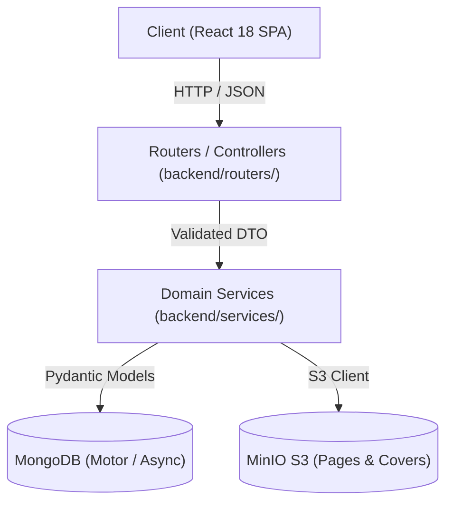

# Architecture Guard Skill: Layer Boundary Enforcement

## 1. Mục Đích & Kiến Trúc Phân Tầng
Dự án tuân thủ nghiêm ngặt mô hình phân tầng **Layered Service-Oriented Architecture**:



---

## 2. Ranh Giới Giữa Các Tầng (Layer Boundaries)

### Tầng 1: Routers / Controllers (`backend/routers/`)
- **Trách nhiệm DUY NHẤT**:
  1. Khai báo endpoint HTTP (Method, Path, Response Model, Status Code, Tags).
  2. Parse và validate tham số đầu vào (Path params, Query params, Request Body DTO).
  3. Ủy quyền xử lý cho Service tương ứng (Dependency Injection hoặc singleton instance).
  4. Trả về kết quả cho Client với HTTP status chuẩn RESTful.
- 🚫 **NGHIÊM CẤM TUYỆT ĐỐI**:
  - **Không gọi trực tiếp Database**: Nghiêm cấm `db.collection.find()`, `insert_one()`, `$aggregate` bên trong router. Toàn bộ phải qua Service.
  - **Không tính toán nặng**: Không thực hiện thuật toán lemmatization, OCR, image processing, parse HTML MangaDex hoặc tổng hợp dữ liệu thống kê bên trong router.

### Tầng 2: Service Layer (`backend/services/`)
- **Trách nhiệm**:
  - Nơi DUY NHẤT chứa business logic, validation nghiệp vụ, state transitions.
  - Điều phối các kho dữ liệu (MongoDB, MinIO, MangaDex External API).
  - Đảm bảo tính toàn vẹn dữ liệu, ghi audit logs khi có tác vụ nhạy cảm.

### Tầng 3: Data Access & Models (`backend/models/`, `backend/database/`)
- Khai báo Schema Pydantic v2 kế thừa từ `BaseModel`.
- Quản lý kết nối MongoDB client, khởi tạo indexes.

---

## 3. Quy Chuẩn Validate Đầu Vào (Input Validation DTO)

- Mọi endpoint nhận payload **BẮT BUỘC** phải có schema Pydantic kiểm tra kiểu và ràng buộc giá trị:
  ```python
  from pydantic import BaseModel, Field
  from typing import Optional

  class MangaCreateRequest(BaseModel):
      title: str = Field(..., min_length=1, max_length=255, description="Tiêu đề manga")
      original_language: str = Field(..., min_length=2, max_length=5)
      total_chapters: Optional[int] = Field(None, ge=0)
  ```
- Không sử dụng kiểu dữ liệu lỏng lẻo như `dict`, `Any` hoặc `Body(...)` không có định dạng schema cho các request body mang tính nghiệp vụ.
