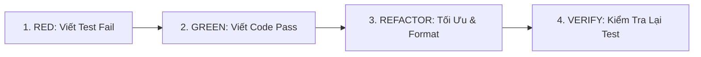

# TDD Workflow & Self-Correction Skill

## 1. Mục Đích & Phạm Vi Áp Dụng
Kỹ năng này áp dụng bắt buộc cho mọi tác vụ phát triển tính năng mới, chỉnh sửa logic nghiệp vụ hoặc mở rộng API, đặc biệt là:
- Tính toán điểm số, xếp hạng (scoring & rating calculations).
- Phân trang, lọc dữ liệu manga, tìm kiếm đa điều kiện (filtering & pagination).
- Quản lý trạng thái đọc (read status transitions & timestamp backfilling).
- Phân quyền, kiểm duyệt bài viết review (review permissions & content policies).
- Pipeline phân tích panel & từ vựng manga (OCR, lemma normalization).

---

## 2. Quy Trình Red - Green - Refactor (Bắt Buộc)



### Bước 1: RED (Viết Test Trước)
- BẮT BUỘC tạo hoặc cập nhật file test trước khi viết bất kỳ dòng logic nghiệp vụ nào:
  - Backend: `backend/tests/test_<feature>.py`
  - Frontend: `frontend/src/tests/<feature>.test.ts`
- Chạy test để xác nhận test **FAIL** đúng với lý do logic chưa tồn tại:
  ```bash
  uv run pytest backend/tests/test_<feature>.py -v
  ```

### Bước 2: GREEN (Viết Code Tối Thiểu Để Pass)
- Viết code nghiệp vụ vào đúng Service Layer (`backend/services/`).
- Chạy lại test đến khi toàn bộ assertions đều **PASS**.

### Bước 3: REFACTOR (Tối Ưu & Định Dạng)
- Tối ưu mã nguồn, loại bỏ duplicate code.
- Chạy linter tự động:
  - Python: `ruff check --fix <file>` và `ruff format <file>`
  - TypeScript: `biome check --write <file>`
- Xác nhận test vẫn PASS 100%.

---

## 3. Cơ Chế Tự Sửa Lỗi Tự Hành (Autonomous Self-Correction Loop)

Khi chạy test mà gặp lỗi (AssertionError, TypeError, Exception, v.v.):

```text
[Lỗi Test] 
   └── Bước 1: Đọc kỹ Stack Trace & Root Cause
   └── Bước 2: Dùng `codegraph impact` / `ast-grep` để khoanh vùng symbol lỗi
   └── Bước 3: Tự điều chỉnh code & chạy lại test
   └── Vòng lặp tối đa: 3 LẦN (Max 3 Attempts)
   └── Nếu sau 3 lần vẫn lỗi: Dừng lại và giải trình nguyên nhân kèm phương án xử lý cho User
```

### Quy tắc bất biến:
- Không bao giờ sửa assertion của test để "làm giả" kết quả pass nếu chưa có sự đồng ý của User.
- Mỗi lần thử sửa (attempt) phải có lý do kỹ thuật rõ ràng căn cứ vào trace log.
