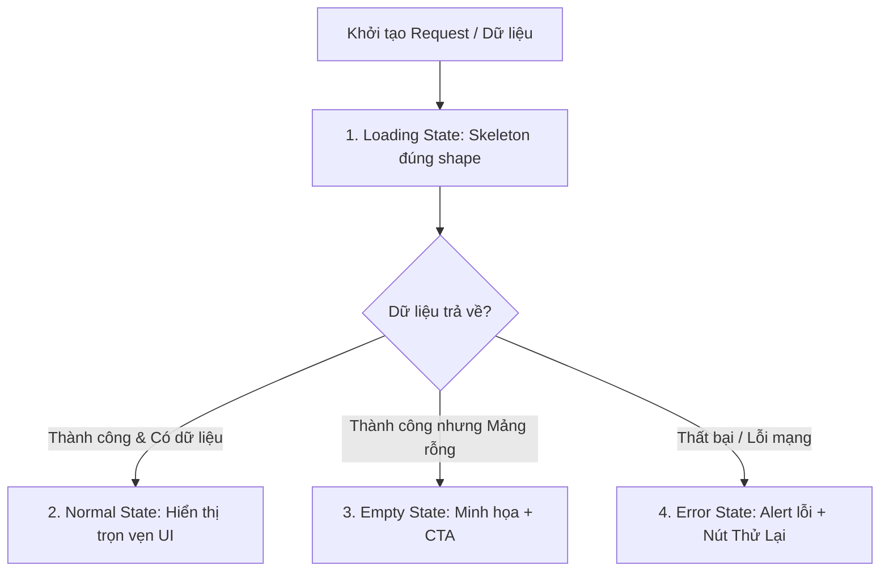

# UI/UX Design & Frontend Engineering Skill

## 1. Mục Đích & Triết Lý Thiết Kế
Tài liệu này định nghĩa các quy chuẩn thiết kế giao diện (UI) và tối ưu hóa trải nghiệm người dùng (UX) cho ứng dụng React (TypeScript) trong dự án **Manga-Reviews-Management**.

- **Tech Stack cốt lõi**: React 19 + TypeScript + Tailwind CSS (v4) + shadcn/ui (Radix primitives) + Lucide Icons.
- **Phong cách thiết kế**: Hiện đại, đậm chất manga/otaku hiện đại (Dark theme chủ đạo, điểm xuyết brand orange `#DA7500` & brand coral `#FF6740`), micro-interactions mượt mà, layout thoáng đãng và chuẩn responsive.

---

## 2. Các Quy Tắc Cốt Lõi (Core Principles)

### Quy Tắc 1: Design System First (Không Hard-code)
1. **Tái sử dụng Component Thư viện**:
   - Luôn ưu tiên tái sử dụng các component đã có trong `@/components/ui/` (`button`, `card`, `badge`, `dialog`, `skeleton`, `tooltip`).
   - Khi cần component mới chưa có trong dự án, **BẮT BUỘC sử dụng shadcn CLI** để nạp:
     ```bash
     pnpm dlx shadcn@latest add <component-name> -y
     ```
2. **Không Viết Inline Styles Tùy Tiện**:
   - 🚫 **NGHIÊM CẤM**: Không viết `style={{ margin: 12, color: '#ff3300' }}`.
   - Ngoại lệ DUY NHẤT: Thuộc tính động bắt buộc từ dữ liệu backend runtime (ví dụ: tọa độ bounding box OCR: `style={{ top: `${box.y}%`, left: `${box.x}%` }}`).
3. **Tuân thủ Token Màu Sắc (Color Tokens)**:
   - Dùng các biến màu ngữ cảnh: `bg-background`, `text-foreground`, `bg-card`, `text-card-foreground`, `border-border`, `text-muted-foreground`, `bg-primary`, `bg-destructive`.
   - Brand color: `text-brand-orange`, `bg-brand-orange`, `text-brand-coral`.

---

### Quy Tắc 2: Manga Reader & OCR Specific UX
1. **Độ Bền Vững Khi Nạp Ảnh (Resilient Image Loading)**:
   - Mọi ảnh manga cover, chapter page, panel cut **BẮT BUỘC** phải có:
     - **Skeleton Loading**: Hiển thị component `<Skeleton />` với đúng aspect-ratio trong khi ảnh đang tải (`onLoad`).
     - **Fallback Image Mechanism**: Bắt lỗi `onError` khi link CDN MangaDex / MinIO lỗi hoặc ảnh bị xóa. Thay thế bằng ảnh placeholder nhẹ nhàng kèm nút "Tải lại ảnh".
   - Ví dụ chuẩn mẫu:
     ```tsx
     const [loaded, setLoaded] = useState(false);
     const [error, setError] = useState(false);

     return (
       <div className="relative aspect-[3/4] overflow-hidden rounded-lg bg-muted">
         {!loaded && !error && <Skeleton className="absolute inset-0 h-full w-full" />}
          setLoaded(true)}
           onError={() => setError(true)}
           className={cn("h-full w-full object-cover transition-opacity duration-300", loaded ? "opacity-100" : "opacity-0")}
         />
       </div>
     );
     ```

2. **Hiển Thị Text OCR & Danh Sách Từ Vựng (Vocabulary)**:
   - **Độ tương phản cao**: Text OCR trích xuất phải đạt chuẩn WCAG AA (tối thiểu 4.5:1), nền tối phải dùng chữ sáng rõ (`text-zinc-100` trên nền `bg-zinc-900/90`).
   - **Tách biệt text gốc và bản dịch**:
     - Text gốc tiếng Nhật/Anh: In đậm vừa, kích thước rõ ràng, có badge đánh dấu ngôn ngữ.
     - Nghĩa / Dịch tiếng Việt: Font phụ, màu êm hơn (`text-muted-foreground`), phân cách rõ ràng bằng card hoặc divider.
   - **Quick-Lookup Tooltip**: Mỗi từ khóa/kanji quan trọng phải bọc trong `<Tooltip>` để hover/tap xem nhanh furigana, từ loại (noun/verb/adj) và cấp độ (JLPT N5-N1).

---

### Quy Tắc 3: State Completeness (Đầy Đủ 4 Trạng Thái Bắt Buộc)
Mọi component danh sách, trang dữ liệu hoặc panel viewer đều phải xử lý đầy đủ **4 trạng thái**:



1. **Loading State**: Sử dụng `<Skeleton className="..." />` xếp theo đúng grid/card layout sắp hiển thị. Cấm dùng màn hình trắng trơn hoặc 1 spinner tròn đơn điệu.
2. **Normal State**: Hiển thị dữ liệu chính với typography phân cấp, badges trạng thái, animations hover.
3. **Empty State**: Khi dữ liệu rỗng (`items.length === 0`), hiển thị icon trực quan (từ `lucide-react`), thông điệp giải thích lý do và 1 nút CTA dẫn hướng (ví dụ: *"Chưa có từ vựng nào được nhận diện. Bấm 'Bắt đầu quét OCR' để trích xuất"*).
4. **Error State**: Hiển thị thông báo lỗi rõ ràng, mã lỗi hoặc lý do thân thiện, cùng nút CTA `Thử lại (Retry)` để người dùng không bị kẹt.

---

### Quy Tắc 4: Mobile-First Responsive Design
- **Khởi điểm 375px**: Mọi layout phải hiển thị hoàn hảo từ màn hình điện thoại (375px) đến máy tính bảng (768px) và màn hình lớn (1280px / 1920px).
- **Quy tắc Breakpoint Tailwind**:
  - Mặc định: Mobile layout (Single column, flex-col, full-width).
  - `sm:` (640px) / `md:` (768px): 2 columns, thanh công cụ ngang.
  - `lg:` (1024px) / `xl:` (1280px): Multi-column grid, sidebar cố định hoặc sticky layout.
- **Touch Target**: Mọi nút bấm, icon button trên mobile phải có kích thước tương tác tối thiểu 44x44px (`min-h-[44px] min-w-[44px]`).

---

### Quy Tắc 5: Visual Auditing & Accessibility (A11y)
Trước khi bàn giao hoặc hoàn tất giao diện:
1. **Kiểm tra Responsive tự động với Playwright**:
   ```bash
   pnpm test:visual --routes / manga/1 panel-words-detector
   ```
2. **Kiểm tra Accessibility tự động với axe-core**:
   ```bash
   pnpm test:a11y
   ```
3. **Tự động Format Code với Biome**:
   ```bash
   npx @biomejs/biome check --write <target-files>
   ```

---

## 3. Checklist Tự Kiểm Tra (UI/UX Definition of Done)
- [ ] Đã dùng shadcn/ui components (`button`, `card`, `badge`, `dialog`, `skeleton`, `tooltip`) chưa?
- [ ] Không có mã màu hex lạ hay inline style hard-coded?
- [ ] Ảnh manga có Skeleton loading và fallback error image chưa?
- [ ] Text OCR có độ tương phản cao, tách biệt rõ ràng text gốc và nghĩa tiếng Việt?
- [ ] Đã có đủ 4 trạng thái (Loading, Normal, Empty, Error) chưa?
- [ ] Đã kiểm tra responsive trên mobile (375px) không bị tràn ngang (horizontal overflow) chưa?
