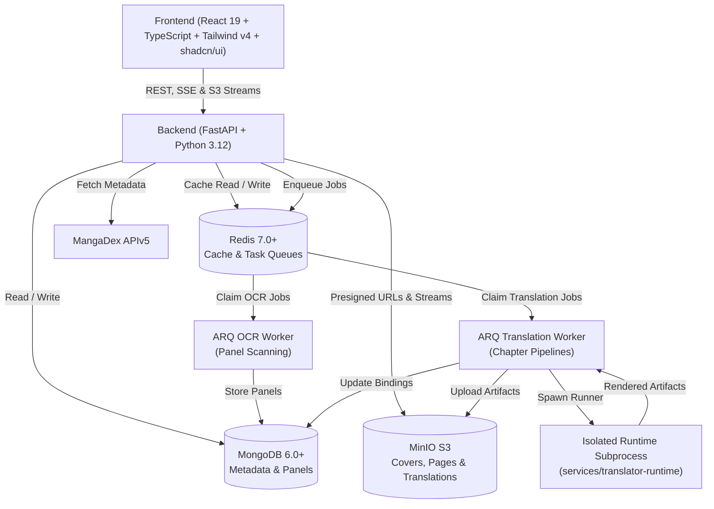

# Manga Reviews Management & AI Vision Lexis System

<p align="center">
  
</p>

<p align="center">
  <strong>An advanced, self-hosted Manga Library, Interactive Review Editor, MangaDex Reader, and Computer Vision & Dialogue Search Platform.</strong>
</p>

<p align="center">
  
  
  
  
  
  
  
  
  
  
  
</p>

> 🤖 **AI Coding Assistant & Contributor Quick Links**:
> - **Orientation & Stack Truth**: [`docs/ai-context.md`](docs/ai-context.md)
> - **Architecture & Sequence Flows**: [`docs/architecture.md`](docs/architecture.md)
> - **Task-to-Files Locator**: [`docs/code-map.md`](docs/code-map.md)
> - **Local Setup & Testing**: [`docs/development.md`](docs/development.md)
> - **Agent Coding Guidelines**: [`AGENTS.md`](AGENTS.md)
> - **Security Policy**: [`SECURITY.md`](SECURITY.md)

---

## 🌟 Overview

**Manga Reviews Management** is a personal manga management ecosystem designed for manga readers, collectors, reviewers, and language learners. It combines **local object storage (MinIO S3)**, **automated MangaDex synchronization**, a **distraction-free reader with side-by-side AI translation comparison**, a **dedicated Translation Studio**, a **rich TipTap review editor with Gemini AI assistance**, a **Redis caching & ARQ async queue**, and an innovative **Panel Words Detector** that indexes comic dialogues directly from page artwork using Computer Vision and NLP.

---

## ✨ Key Features

### 1. 🌐 Manga AI Translation Studio & In-Reader Translation
- **Reader Split-View Comparison**: Compare original manga artwork and AI-translated pages using an interactive split comparison slider (`clip-path`) or toggle mode.
- **Dedicated Translation Studio (`/translation`)**: 7-tab console for chapter job orchestration, typography diagnostics, synthetic mock workspace, and live storage audit.
- **Isolated Subprocess Runtime Envelope**: Heavy ML dependencies (OCR, translation models, inpainting) run in an isolated CLI runner envelope (`services/translator-runtime`), protecting FastAPI from memory leaks and C++ library collisions.
- **Pure-Canvas Re-rendering (Zero LLM Tokens)**: Pillow-based canvas renderer enables instant font, alignment, and translation text tweaks without paying extra LLM token costs.
- **Vietnamese Typography Engine**: Pure-Python TrueType/OpenType glyph validator verifies Vietnamese diacritics coverage (`ơ`, `ư`, `ắ`, `ề`, `ộ`) before rasterization.
- **Sequential ZIP Chapter Export**: Export translated chapters with zero-padded filenames and structured `manifest.json`.

### 2. 🔍 System-Wide Panel Words Detector (Manga Lexis & Vision)
- **Automatic Panel Segmentation**: Uses OpenCV contour hierarchy analysis to isolate individual comic panels from raw pages.
- **PP-OCRv4 Text Detection**: RapidOCR ONNX pipeline extracts stylized manga dialogue across complex comic bubble geometries.
- **NLP Dialogue Normalization & Lemmatization**: Uses `spaCy` (`en_core_web_sm`) and `wordninja` to de-hyphenate broken dialogue words, convert uppercase comic lettering to natural case, and extract vocabulary lemmas and POS tags.
- **Library-Wide Search Engine**: Instantly search words, dialogue quotes, or grammatical roots across **all manga and chapters** in your system.
- **Rich Origin Metadata**: Displays manga poster thumbnail, chapter/volume/page/panel coords, golden-amber highlight, and clickable vocabulary tokens.
- **Dynamic In-RAM JPEG Cropping**: Streams cropped panel artwork directly from MinIO page bytes without storing duplicate cropped images on disk.
- **Interactive Dictionary Popover**: Click any dialogue token to view phonetic IPA pronunciation, audio playback, and definitions.
- **One-Click Jump to Reader**: Direct shortcut into the full reader at the exact page.

### 3. 📖 Immersive Manga Reader (`/manga/:id/read/:chapterId`)
- **Reading Modes**: Long Strip (webtoon vertical), Single Page, Double Page Left-to-Right, Double Page Right-to-Left (traditional manga).
- **Fit Controls**: Fit to Width, Fit to Height, Original Scale.
- **Smooth Zoom System**: 30% to 300% zoom scaling with keyboard shortcuts (`+`, `-`, `0`).
- **Reading Progress & Hotkeys**: Auto-saves last read chapter/page to MongoDB; full keyboard navigation (`Arrow keys`, `Space`, `F` for fullscreen).

### 4. ⚡ High-Performance Caching & Async Task Worker
- **Redis Caching Pool**: Sub-millisecond response times for manga details and reviews list with auto-fallback to MongoDB when Redis is unavailable.
- **ARQ Task Worker**: Standalone background workers decoupled from the HTTP server process for OCR and Translation pipelines.
- **Task Management API**: Query task status and cancel long-running jobs via standard REST endpoints.

### 5. 📥 High-Throughput Download & Storage Manager
- **Anti-Freeze Concurrency Engine**: Asynchronous chapter downloader decoupled from main HTTP server threads, preventing API lockups during bulk downloads.
- **MinIO Object Storage**: High-speed S3-compatible local bucket (`manga-library`) with deduplication checks (MD5 hash).
- **Smart Folder Parsing**: Intelligently parses folder naming conventions (`Vol. 1 Ch. 2`, `Chapter 1 - Title [Group]`, `Oneshot`).
- **Storage Management UI**: Pagination controls, natural numeric sorting, duplicate detection, and cascading panel metadata cleanup.

### 6. ✍️ Rich Media Review Editor & Gemini AI
- **TipTap WYSIWYG Editor**: Slash commands (`/`), resizable images, audio recordings, video player, file attachments.
- **Interactive Manga Reference Mentions**: Type `@manga` to embed live manga cards with hover tooltips.
- **Gemini AI Integration**: AI-assisted grammar refinement, tone adjustment, automatic summary generation, and chapter scene analysis.

### 7. 🔄 MangaDex Sync & Automation
- **APIv5 Integration**: Direct metadata synchronization (titles, alternative titles, authors, artists, publication status, original language).
- **Cover Art Gallery**: Batch downloader for high-res official MangaDex cover art with presigned URLs.
- **MangaDex Official Tags**: 70+ categorized genre and theme tags.

### 8. 📊 Analytics, Telemetry & Audit Logs
- Comprehensive charts: Reading statuses, personal ratings distribution, genres breakdown, download volume, and time-stamped audit logs for all library operations.

---

## 🏗️ Architecture



---

## 🛠️ Technology Stack

| Layer | Technologies |
|---|---|
| **Backend** | Python 3.12, FastAPI, Motor (Async MongoDB), Pydantic v2, Uvicorn |
| **Translation Engine** | Isolated Subprocess CLI Runner (`services/translator-runtime`), Pillow (Pure Canvas), Custom TTF Glyph Validator |
| **Vision & NLP** | OpenCV (`opencv-python-headless`), RapidOCR (PP-OCRv4 ONNX), spaCy (`en_core_web_sm`), Wordninja, MangaOCR |
| **Caching & Queues** | Redis (Alpine), ARQ (Async Redis Queue workers for OCR and Translation) |
| **Frontend** | React 19, TypeScript, Tailwind CSS v4, shadcn/ui (`radix-nova`), Vite, TipTap Editor, Lucide Icons, Axios |
| **Database & S3** | MongoDB 6.0+ (standalone), MinIO Object Storage (S3-compatible `manga-library`) |
| **AI / LLM** | Google Generative AI (Gemini 1.5 Flash / Pro) |
| **Testing & QA** | Pytest, Biome (TS/TSX Linter), `@axe-core/cli` (A11y), Playwright (Visual Responsive Runner) |

---

## 🚀 Quick Start Guide

Detailed guide available at [`docs/development.md`](docs/development.md).

### 1. Prerequisites
- [Docker](https://www.docker.com/) & Docker Compose
- [Node.js](https://nodejs.org/) (v20 or newer) & [pnpm](https://pnpm.io/) (v10 or newer)
- [Python](https://www.python.org/) (v3.12 or newer) & [`uv`](https://docs.astral.sh/uv/)
- [MongoDB](https://www.mongodb.com/) (v6.0 or newer running locally or via dedicated container on port 27017)

---

### 2. Infrastructure Setup (MinIO & Redis)

Start MinIO and Redis containers using Docker Compose:

```bash
docker compose -f backend/docker-compose.yml up -d minio redis
```

- **MinIO S3 API**: `http://localhost:9000`
- **MinIO Web Console**: `http://localhost:9001` (Credentials: `admin` / `password`)
- **Redis**: `localhost:6379`
- *Note*: Ensure MongoDB is running on `localhost:27017`.

---

### 3. Backend Setup

1. Sync dependencies with `uv`:

```bash
uv sync --project backend
```

2. Configure environment variables:

```bash
cp backend/.env.example backend/.env
```

3. Initialize database indexes and seed tags:

```bash
python setup_env.py
python seed_mangadex_tags.py
```

4. Start FastAPI server:

```bash
uv run --project backend uvicorn backend.main:app --reload --host 127.0.0.1 --port 8000
```
Swagger UI will be at `http://localhost:8000/docs`.

5. *(Optional)* Start ARQ background workers in separate terminals:

```bash
# Vision OCR Worker (Panel segmentation and NLP lexis extraction)
uv run --project backend arq backend.tasks.worker.WorkerSettings

# Translation Worker (Manga AI chapter translation pipeline)
uv run --project backend arq backend.tasks.translation_worker.WorkerSettings
```

---

### 4. Frontend Setup

1. Install dependencies:

```bash
pnpm --dir frontend install
```

2. Start Vite development server:

```bash
pnpm --dir frontend dev
```

The application will be running at `http://localhost:5173`.
