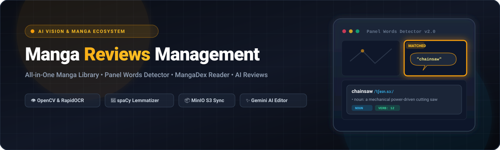
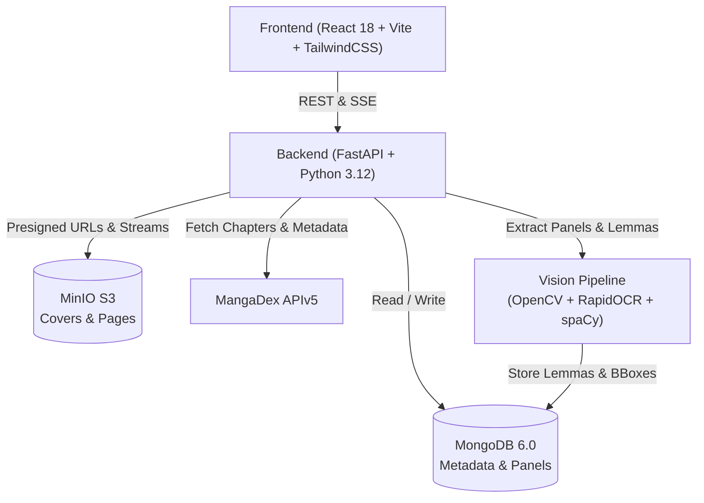

# Manga Reviews Management & AI Vision Lexis System

<p align="center">
  
</p>

<p align="center">
  <strong>An advanced, self-hosted Manga Library, Interactive Review Editor, MangaDex Reader, and Computer Vision & Dialogue Search Platform.</strong>
</p>

<p align="center">
  
  
  
  
  
  
  
  
  
</p>

---

## 🌟 Overview

**Manga Reviews Management** is an enterprise-grade personal manga management ecosystem designed for avid manga readers, collectors, reviewers, and language learners. It goes far beyond a simple bookmark manager by combining **high-performance local storage (MinIO S3)**, **automated MangaDex synchronization**, a **MangaDex-style distraction-free reader**, a **rich TipTap review editor with Gemini AI assistance**, and an innovative **Panel Words Detector** that indexes comic dialogues directly from page artwork using Computer Vision and NLP.

---

## ✨ Key Features

### 1. 🔍 System-Wide Panel Words Detector (Manga Lexis & Vision)
- **Automatic Panel Segmentation**: Uses OpenCV contour hierarchy analysis to isolate individual comic panels from raw pages.
- **PP-OCRv4 Text Detection**: RapidOCR ONNX pipeline extracts stylized manga dialogue across complex comic bubble geometries.
- **NLP Dialogue Normalization & Lemmatization**: Uses `spaCy` (`en_core_web_sm`) and `wordninja` to de-hyphenate broken dialogue words, convert uppercase comic lettering to natural case, and extract vocabulary lemmas and POS tags.
- **Library-Wide Search Engine**: Instantly search words, dialogue quotes, or grammatical roots across **all manga and chapters** in your system.
- **Rich Origin Metadata**: Every search result displays:
  - Manga poster thumbnail + series title (direct link to series).
  - Volume number (`Vol. X`), Chapter number & title (`Ch. Y`), Page number (`Trang Z`), Panel index (`Panel #N`).
  - Dialogue snippet with query highlighted in golden amber.
  - Interactive clickable vocabulary tokens.
- **Dynamic In-RAM JPEG Cropping**: Streams cropped panel artwork directly from MinIO page bytes without storing duplicate cropped images on disk.
- **Full-Page Visual Focus**: Inspect raw original pages with an animated **golden focus bounding box** framing the matched panel.
- **Interactive Dictionary Popover**: Click any dialogue token to view phonetic IPA pronunciation, audio playback (native recordings or Web Speech API), and definitions.
- **One-Click Jump to Reader**: Direct shortcut into the full reader at the exact page.

### 2. 📖 Immersive Manga Reader (`/manga/:id/read/:chapterId`)
- **Reading Modes**: Long Strip (webtoon vertical), Single Page, Double Page Left-to-Right, Double Page Right-to-Left (traditional manga).
- **Fit Controls**: Fit to Width, Fit to Height, Original Scale.
- **Smooth Zoom System**: 30% to 300% zoom scaling with keyboard shortcuts (`+`, `-`, `0`).
- **Reading Progress & Hotkeys**: Auto-saves last read chapter/page to MongoDB; full keyboard navigation (`Arrow keys`, `Space`, `F` for fullscreen).

### 3. 📥 High-Throughput Download & Storage Manager
- **Anti-Freeze Concurrency Engine**: Asynchronous chapter downloader decoupled from main HTTP server threads, preventing API lockups during 100+ chapter bulk downloads.
- **MinIO Object Storage**: High-speed S3-compatible local bucket (`manga-library`) with deduplication checks (MD5 hash).
- **Smart Folder Parsing**: Intelligently parses folder naming conventions (`Vol. 1 Ch. 2`, `Chapter 1 - Title [Group]`, `Oneshot`).
- **Storage Management UI**: Detailed pagination controls (10, 25, 50, 100 chaps/page), natural numeric sorting, duplicate detection, and cascading panel metadata cleanup.

### 4. ✍️ Rich Media Review Editor & Gemini AI
- **TipTap WYSIWYG Editor**: Slash commands (`/`), resizable images, audio recordings, video player, file attachments.
- **Interactive Manga Reference Mentions**: Type `@manga` to embed live manga cards with hover tooltips.
- **Gemini AI Integration**: AI-assisted grammar refinement, tone adjustment, automatic summary generation, and chapter scene analysis.

### 5. 🔄 MangaDex Sync & Automation
- **APIv5 Integration**: Direct metadata synchronization (titles, alternative titles, authors, artists, publication status, original language).
- **Cover Art Gallery**: Batch downloader for high-res official MangaDex cover art with presigned URLs.
- **MangaDex Official Tags**: 70+ categorized genre and theme tags.

### 6. 📊 Analytics, Telemetry & Audit Logs
- Comprehensive charts: Reading statuses, personal ratings distribution, genres breakdown, download volume, and time-stamped audit logs for all library operations.

---

## 🏗️ Architecture



---

## 🛠️ Technology Stack

| Layer | Technologies |
|---|---|
| **Backend** | Python 3.12, FastAPI, Motor (Async MongoDB), Pydantic v2, Uvicorn |
| **Vision & NLP** | OpenCV (`opencv-python-headless`), RapidOCR (PP-OCRv4 ONNX), spaCy (`en_core_web_sm`), Wordninja |
| **Frontend** | React 18, TypeScript, TailwindCSS 3.4, Vite, TipTap Editor, Lucide Icons, Axios |
| **Database & S3** | MongoDB 6.0+, MinIO Object Storage (S3-compatible) |
| **AI / LLM** | Google Generative AI (Gemini 1.5 Flash / Pro) |

---

## 🚀 Quick Start Guide

### 1. Prerequisites
- [Docker](https://www.docker.com/) & Docker Compose
- [Node.js](https://nodejs.org/) (v18 or newer)
- [Python](https://www.python.org/) (v3.12 or newer)

---

### 2. Infrastructure Setup (Docker)

Start MongoDB and MinIO services:

```bash
cd backend
docker compose up -d
```

- **MongoDB**: `localhost:27017`
- **MinIO Console**: `http://localhost:9001` (Credentials: `admin` / `password`)
- **MinIO S3 API**: `http://localhost:9000`

---

### 3. Backend Setup

1. Navigate to the backend directory and create a virtual environment:

```bash
cd backend
python -m venv .venv
```

Activate the virtual environment:
- **Windows (PowerShell)**: `.\.venv\Scripts\Activate.ps1`
- **Linux/macOS**: `source .venv/bin/activate`

2. Install dependencies:

```bash
pip install -r pyproject.toml
# Or using uv:
# uv pip install -e .
```

3. Download the spaCy English NLP model:

```bash
python -m spacy download en_core_web_sm
```

4. Configure environment variables:

```bash
cp .env.example .env
```

Edit `.env` to verify your MongoDB, MinIO, and Gemini API keys:

```ini
MONGODB_URI=mongodb://localhost:27017
DATABASE_NAME=manga_library
MINIO_ENDPOINT=localhost:9000
MINIO_ACCESS_KEY=admin
MINIO_SECRET_KEY=password
MINIO_BUCKET=manga-library
DOWNLOAD_DIR=./downloads
PORT=8000
GEMINI_API_KEY=your_gemini_api_key_here
```

5. Initialize database indexes and seed MangaDex tags:

```bash
# Run from repository root
python setup_env.py
python seed_mangadex_tags.py
```

6. Start the FastAPI development server:

```bash
python -m uvicorn backend.main:app --reload --port 8000
```

The API will be available at `http://localhost:8000` (Docs: `http://localhost:8000/docs`).

---

### 4. Frontend Setup

1. Open a new terminal in the `frontend` directory:

```bash
cd frontend
pnpm install
```

2. Start the Vite development server:

```bash
pnpm run dev
```

Open your browser at `http://localhost:5173`.

---

## 📁 Repository Structure

```text
Manga-Reviews-Management/
├── backend/
│   ├── database/         # Motor connection & index setup
│   ├── models/           # Pydantic models (Manga, Chapter, Panel, Review, Tag)
│   ├── routers/          # FastAPI routers (manga, chapters, vision, reviews, etc.)
│   ├── services/         # Core business logic:
│   │   ├── vision_service.py         # OpenCV segmentation & RapidOCR detection
│   │   ├── panel_scanner_service.py  # NLP lemmatization, cascading hooks & search
│   │   ├── dictionary_service.py     # Free Dictionary API cache & resolver
│   │   ├── chapter_service.py        # Chapter storage, downloader & page mapping
│   │   ├── manga_service.py          # Manga CRUD & MangaDex sync
│   │   └── minio_service.py          # S3 presigned URLs & object operations
│   ├── tests/            # System & panel regression test suites
│   ├── docker-compose.yml# Docker services (MongoDB, MinIO)
│   ├── pyproject.toml    # Python dependencies
│   └── .env.example      # Sample environment configuration
│
├── frontend/
│   ├── src/
│   │   ├── components/
│   │   │   ├── editor/   # TipTap rich text review editor extensions
│   │   │   ├── layout/   # Sidebar navigation & theme header
│   │   │   ├── manga/    # PanelCard, FullPageModal, WordPopover, CoverArtGallery
│   │   │   └── ui/       # DownloadWidget, ThemeToggle, TagSelectors
│   │   ├── pages/        # Core pages:
│   │   │   ├── PanelWordsDetectorPage.tsx # Library-wide dialogue vision search
│   │   │   ├── MangaListPage.tsx          # Main library grid & search
│   │   │   ├── MangaDetailPage.tsx        # Metadata, chapters, tabs & review
│   │   │   ├── MangaReaderPage.tsx        # Distraction-free comic reader
│   │   │   ├── SyncManagerPage.tsx        # MangaDex bulk syncer
│   │   │   └── AnalyticsPage.tsx          # Statistics & telemetry charts
│   │   └── types/        # TypeScript interfaces
│   ├── package.json
│   └── vite.config.ts
│
├── seed_mangadex_tags.py # Database seeder for official MangaDex tags
├── setup_env.py          # MongoDB index & MinIO bucket initializer
├── update_manga_metadata.py # Migration sync utility
├── .gitignore
└── README.md
```

---

## 🔒 Security & Data Integrity

- **Environment Secrets**: Sensitive keys (`.env`, `mangadex_access.txt`) are excluded from version control via `.gitignore`.
- **Presigned URLs**: MinIO media is accessed via short-lived or verified presigned URLs, ensuring secure bucket access.
- **Cascading Constraints**: Deleting a chapter or individual pages automatically purges associated vision panels and re-indexes page sequences, preventing orphan metadata.

---

## 🤝 Contributing

Pull requests are welcome! For major changes, please open an issue first to discuss your proposal.

1. Fork the Project
2. Create your Feature Branch (`git checkout -b feature/AmazingFeature`)
3. Commit your Changes (`git commit -m 'Add some AmazingFeature'`)
4. Push to the Branch (`git push origin feature/AmazingFeature`)
5. Open a Pull Request

---

## 📜 License

Distributed under the MIT License. See `LICENSE` for more information.
