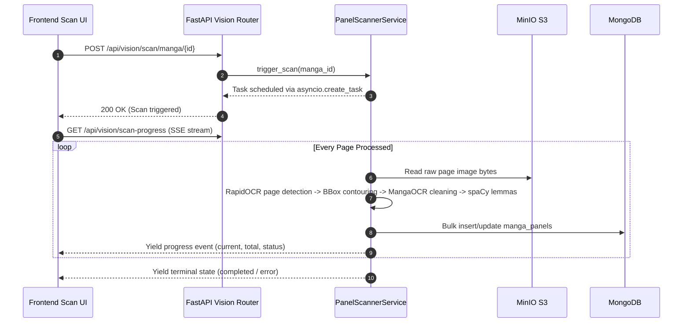
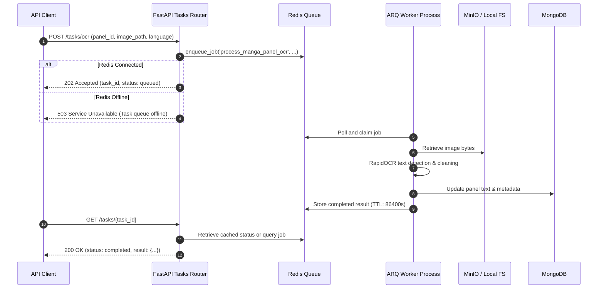
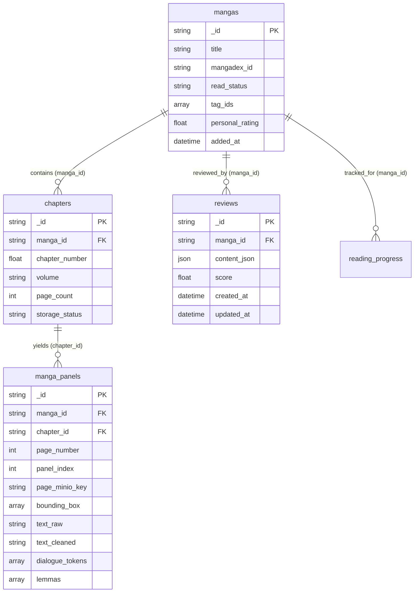

# System Architecture & Technical Flow

> **Source Reference**: [`docs/ai-context.md`](./ai-context.md)  
> **Source Commit Verified**: `c4a6dfb29309b0b0afd5343aa7c5327d31b252ad`

---

## 1. System Topology & Component Interactions

The system follows a modular architecture separating presentation (React 19 SPA), application coordination (FastAPI), persistent datastores (MongoDB & MinIO S3), caching and asynchronous processing (Redis & ARQ), and external integrations:

```mermaid
flowchart TD
    UI["Frontend (React 19 + TypeScript + Tailwind v4)"] -->|REST API & SSE| API["Backend API (FastAPI)"]
    API --> DB[("MongoDB (6.0+ Standalone)\nMetadata, Panels & Reviews")]
    API --> S3[("MinIO S3 (manga-library)\nPages, Covers & Media")]
    UI -->|Direct Presigned URLs| S3
    
    API -->|Cache Read/Write| Redis[("Redis (Alpine)\nCache & Job Queue")]
    API -->|Enqueue OCR Job| Redis
    Redis -->|Consume Task| Worker["ARQ Worker (WorkerSettings)\nprocess_manga_panel_ocr"]
    Worker -->|OCR Results| DB
    Worker -->|Read Page Media| S3
    Worker -->|Write Status & Result| Redis

    API -->|In-Process Scan (asyncio)| Scanner["PanelScannerService\n(OpenCV + RapidOCR + spaCy)"]
    Scanner -->|Read Page Images| S3
    Scanner -->|Write Extracted Panels| DB
    
    API -->|Sync & Metadata| DexAPI["External MangaDex APIv5"]
    API -->|Assistance & Scene Analysis| GeminiAPI["Google Gemini API"]
```

### Architectural Responsibilities:
- **FastAPI Layer** ([`backend/main.py`](../backend/main.py)): Exposes REST endpoints, validates input payloads via Pydantic v2, and manages connection pools in its lifespan context.
- **In-Process Scanner** ([`backend/services/panel_scanner_service.py`](../backend/services/panel_scanner_service.py)): Manages interactive page slicing and dialogue extraction using `asyncio.create_task`, streaming realtime progress to the frontend via Server-Sent Events (SSE).
- **Background Worker** ([`backend/tasks/worker.py`](../backend/tasks/worker.py)): Separate worker process running ARQ to execute heavy computer vision tasks asynchronously off the HTTP loop.
- **Cache Layer** ([`backend/core/redis.py`](../backend/core/redis.py)): Thread-safe Redis connection pool with automatic fallback to database reads if Redis is offline.

---

## 2. Asynchronous Processing Mechanisms

The codebase contains **two distinct** asynchronous mechanisms designed for different operational modes:

### Mechanism A: In-Process Manga Scanner (Interactive UI Flow)
Used by the frontend [`frontend/src/pages/PanelWordsDetectorPage.tsx`](../frontend/src/pages/PanelWordsDetectorPage.tsx) to scan manga chapters with real-time feedback:



### Mechanism B: Distributed ARQ Task Worker (Background Queue Flow)
Used for queue-based task offloading and external API clients:



---

## 3. Data Relationships (Logical Reference Model)

Relationships in MongoDB are maintained at the application layer using standard string/ObjectId references:



---

## 4. Caching & Task State Policies

| Key Template | Store | TTL | Invalidation Trigger | Fallback on Failure |
|---|---|---|---|---|
| `manga:detail:{manga_id}` | Redis | 300s (5 min) | Manga update, chapter add/delete, rating edit | Direct read from MongoDB `mangas` |
| `reviews:manga:{manga_id}` | Redis | 180s (3 min) | Review create, update, or delete | Direct read from MongoDB `reviews` |
| `task:ocr:{task_id}` | Redis | 3,600s (queued/running)<br>86,400s (finished) | Natural TTL expiration | Returns ARQ job status or 404 |

---

## 5. Architectural Reality vs Coding Policy

| Layer | Strict Policy for New Code | Existing Reality in Legacy Code |
|---|---|---|
| **Routers** | Must contain NO direct DB queries or heavy computation. Input must be validated via Pydantic DTOs. | Some routers (e.g. [`backend/routers/reviews.py`](../backend/routers/reviews.py), [`backend/routers/creators.py`](../backend/routers/creators.py)) call `db.collection` directly. |
| **Services** | Dedicated home for all domain logic, transactions, and S3 media coordination. | Most domains have dedicated services (`manga_service`, `chapter_service`, `download_service`), but there is no `review_service.py`. |
| **Frontend** | Must use shadcn/ui components (`@/components/ui/`), semantic theme variables, and handle all 4 states (`Loading`, `Normal`, `Empty`, `Error`). | Legacy pages have been updated to use shadcn primitives, with TipTap custom extensions adhering to the design system. |
