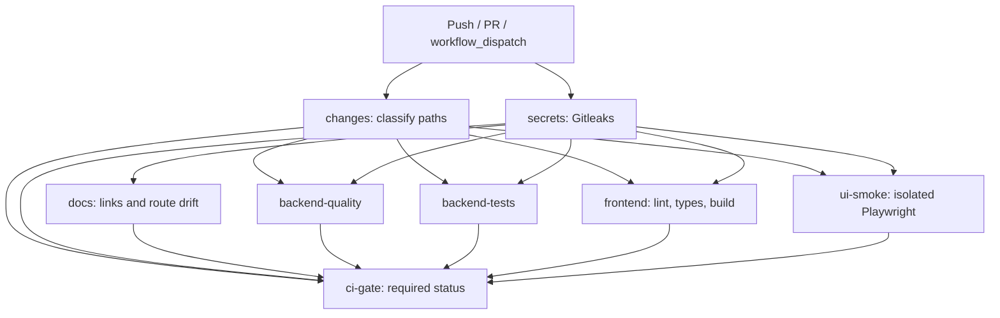

# CI/CD Pipeline & Guardian Architecture

## 1. Overview & Principles

Manga-Reviews-Management implements an automated Continuous Integration pipeline in GitHub Actions ([`.github/workflows/ci.yml`](../.github/workflows/ci.yml)), governed by the [CI/CD Guardian](../.antigravity/skills/ci-cd-guardian.md).

### Core Directives
1. **Security-First**: Every execution begins with Gitleaks secret scanning across full commit history before subsequent jobs run.
2. **Path-Aware Execution**: Workflows classify changes via `dorny/paths-filter`. Unmodified stacks are safely skipped without failing required status checks.
3. **Aggregate Status Gate**: Merge protection relies on a single aggregate gate check (`ci-gate`), eliminating pending check deadlocks on selective path PRs.
4. **Toolchain Parity**: Local validation and remote CI use identical locked dependency groups (`uv` for Python, `pnpm` for Node.js).
5. **Decoupled Delivery**: Continuous Integration (validation/lint/test/build) is strictly separated from Continuous Deployment (CD). Automated deployments to personal machines with user data are disabled until isolated targets and rollback protocols are configured.

---

## 2. Pipeline Flowchart



---

## 3. Jobs & Execution Contracts

| Job ID | Conditions | Key Steps | Purpose |
|---|---|---|---|
| `changes` | Unconditional | `dorny/paths-filter@v3` | Classifies backend, frontend, API contract, and pipeline diffs into boolean outputs. |
| `secrets` | Unconditional | `gitleaks/gitleaks-action@v2` | Scans commit range for credential and secret leakage. |
| `docs` | After `secrets` | `python scripts/check_docs.py`<br>`python scripts/generate_api_routes.py --check` | Prevents documentation broken links and API route reference drift. |
| `backend-quality` | `backend_required == 'true'` | `uv sync --only-group lint`<br>`python scripts/ci/check_python.py` | Locked Ruff lint and format check across all tracked Python files. |
| `backend-tests` | `backend_required == 'true'` | `uv sync --group test`<br>`python -m pytest backend/tests` | Runs unit, OCR, report, and system regression tests (74 items). |
| `frontend` | `frontend_required == 'true'` | `pnpm --dir frontend run check`<br>`pnpm --dir frontend run typecheck`<br>`pnpm --dir frontend run build` | Biome lint/format, TypeScript project reference typecheck (`tsc -b`), and Vite production bundle. |
| `ui-smoke` | `ui_required == 'true'` | `playwright install --with-deps chromium`<br>`pnpm --dir frontend run test:e2e` | Runs responsive Playwright browser smoke tests on Desktop (1440px) and Mobile (375px). |
| `ci-gate` | `always()` after all jobs | `python scripts/ci/assert_gate.py` | Evaluates results against change requirements. Ensures required jobs succeeded and skips were intentional. |

---

## 4. Local Command Reproduction

To verify changes locally before pushing:

### Backend (Python)
```bash
# Lint and format check
uv run --project backend python scripts/ci/check_python.py

# Test suite execution
uv run --project backend python -m pytest backend/tests
```

### Frontend (React / TypeScript)
```bash
# Biome code quality check
pnpm --dir frontend run check

# TypeScript project references typecheck
pnpm --dir frontend run typecheck

# Production build validation
pnpm --dir frontend run build

# Playwright smoke tests
pnpm --dir frontend run test:e2e
```

### Documentation & Routes
```bash
python scripts/check_docs.py
python scripts/generate_api_routes.py --check
```

---

## 5. CI Guardian & Repair Protocol

When interacting with CI:
1. **Inspect Run by Commit SHA**:
   ```powershell
   gh run list --workflow ci.yml --commit (git rev-parse HEAD).Trim() --limit 5
   ```
2. **Review Failed Logs**:
   ```powershell
   gh run view <RUN_ID> --log-failed
   ```
3. **Autonomous Repair Budget**: Up to 3 self-correction iterations per issue following TDD principles.
4. **Integrity Rule**: Never bypass CI gate checks via `continue-on-error: true` or synthetic passes.
